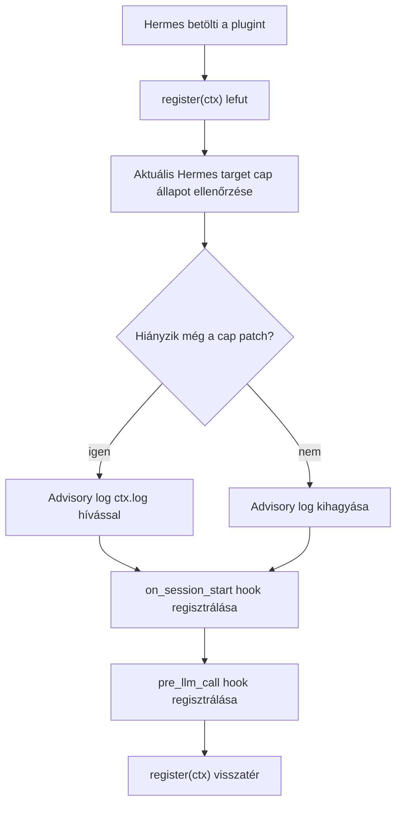
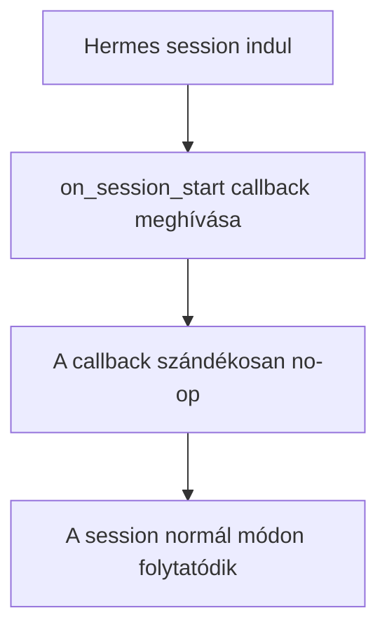
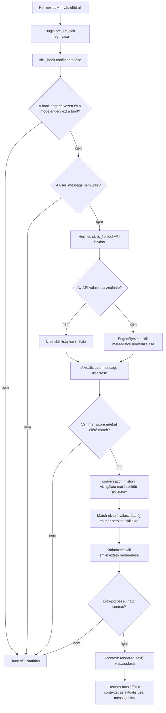
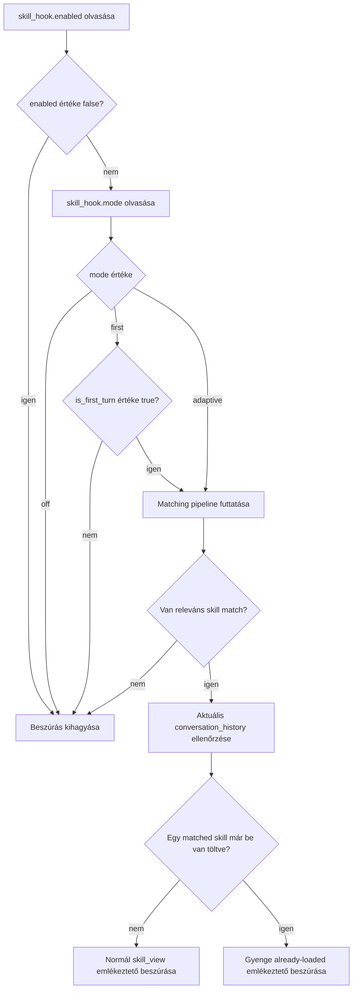
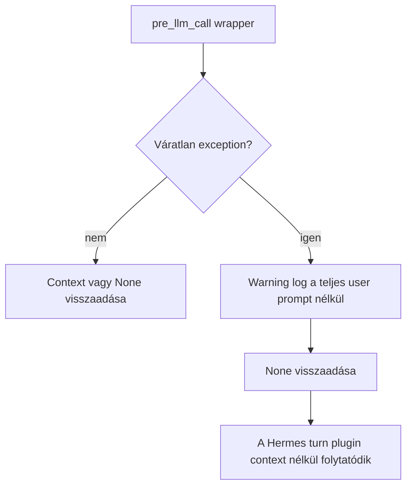

# WOW Skills Plugin Hook folyamatábrák

🇬🇧 **[English version →](wow-skills-flowcharts.md)**

Ez a dokumentum csak az adaptív WOW skills funkció által hozzáadott plugin
hook működését írja le. Nem tárgyalja a release-t, a CI-t, a csomagolást vagy
a Hermes core patchert.

A plugin két Hermes hookot regisztrál:

- `on_session_start` megtartja a meglévő advisory hook regisztrációját.
- `pre_llm_call` opcionálisan egy rövid, csak az aktuális turnre érvényes
  skill emlékeztetőt szúr be az aktuális user-message contextbe.

## Hook regisztráció



A plugin nem hív `ctx.register_skill` függvényt. A skill discovery továbbra is
a Hermesben marad; ez a plugin csak hook callbackeket ad hozzá.

## `on_session_start` hook



Az advisory ellenőrzés a `register(ctx)` alatt történik. A session-start
callback azért létezik, hogy a Hermes lássa a plugin által deklarált hookot,
de nem módosít conversation state-et.

## `pre_llm_call` hook



A visszaadott context csak az adott LLM hívásra érvényes. Nem system prompt
patch, és nem tölti be a teljes `SKILL.md` tartalmat. Ha egy illeszkedő skill
már be lett töltve `skill_view` vagy Hermes skill slash command útján, a plugin
csak gyenge "already loaded" emlékeztetőt renderel, nem ajánlja újra a fő
`skill_view` hívást.

## Mode döntés



A `first` és az `adaptive` ugyanazt a matchert használja. A `first` csak az
első turnön engedi lefutni a matchert.

## Fail-open út



Egy hibás hook nem törheti el az agent turnt.

## Chat példa 1: adaptive match contextet szúr be

Config:

```yaml
plugins:
  enabled:
    - easter-hermes-sorry-skills-plugin
  entries:
    easter-hermes-sorry-skills-plugin:
      skill_hook:
        enabled: true
        mode: adaptive
        output: shortlist
        top_k: 3
        min_score: 2
```

A Hermes `skills_list()` által visszaadott engedélyezett skill metaadat:

```json
{
  "success": true,
  "skills": [
    {
      "name": "skill-creator",
      "description": "Use when creating or improving SKILL.md instructions.",
      "category": "skills"
    },
    {
      "name": "code-review",
      "description": "Use when reviewing code changes for bugs and regressions.",
      "category": "coding"
    }
  ]
}
```

Conversation az LLM hívás előtt:

```text
User:
Create a new Hermes skill for reviewing Python CLI changes.
```

Plugin döntés:

- `mode=adaptive` engedi ezt a turnt.
- `user_message` nem üres.
- `skills_list()` sikeres.
- `skill-creator` illeszkedik a description tokenek alapján: `skill`,
  `creating`.
- `code-review` illeszkedik a description/category tokenek alapján:
  `reviewing`, `code`, `changes`.
- Legalább egy match eléri a `min_score` értéket.

A plugin által visszaadott context:

```text
Relevant Hermes skills to consider:
- code-review: Use when reviewing code changes for bugs and regressions.
- skill-creator: Use when creating or improving SKILL.md instructions.

Use skill_view(name) only if the current task actually matches.
```

Amit a Hermes konceptuálisan elküld az aktuális LLM hívásba:

```text
User:
Create a new Hermes skill for reviewing Python CLI changes.

[Plugin context]
Relevant Hermes skills to consider:
- code-review: Use when reviewing code changes for bugs and regressions.
- skill-creator: Use when creating or improving SKILL.md instructions.

Use skill_view(name) only if the current task actually matches.
```

Elvárt model viselkedés:

```text
Assistant:
I should inspect the relevant skill before drafting this. Calling
skill_view(name="skill-creator") is appropriate because the user is asking to
create a skill.
```

## Chat példa 2: már betöltött skill csak gyenge emlékeztetőt kap

A config ugyanaz, mint az 1. példában.

Conversation az aktuális LLM hívás előtt:

```text
User:
Review this Python CLI patch.

Assistant tool call:
skill_view(name="code-review")

Tool result:
{
  "success": true,
  "name": "code-review",
  "content": "...full SKILL.md instructions..."
}

Assistant:
I loaded the code-review skill and will use it for the review.

User:
Now review the updated tests too.
```

Plugin döntés a második user turnön:

- `mode=adaptive` engedi ezt a turnt.
- `skills_list()` sikeres.
- `code-review` továbbra is illeszkedik az aktuális user message-re.
- A `conversation_history` tartalmaz egy sikeres fő
  `skill_view(name="code-review")` eredményt.
- A match már betöltöttként van kezelve.

A plugin által visszaadott context:

```text
Already loaded relevant Hermes skills:
- code-review

Follow already loaded skill instructions; call skill_view(name) again only for linked files.
```

Amit a Hermes konceptuálisan elküld az aktuális LLM hívásba:

```text
User:
Now review the updated tests too.

[Plugin context]
Already loaded relevant Hermes skills:
- code-review

Follow already loaded skill instructions; call skill_view(name) again only for linked files.
```

Elvárt model viselkedés:

```text
Assistant:
Continue using the already loaded code-review instructions. Do not reload the
main skill content unless a linked reference file is needed.
```

## Chat példa 3: nincs match, nincs context

A config ugyanaz, mint az 1. példában.

Conversation az LLM hívás előtt:

```text
User:
What time is it in Budapest?
```

Plugin döntés:

- `mode=adaptive` engedi az értékelést.
- `skills_list()` sikeres.
- Egy engedélyezett skill metaadata sem illeszkedik elég erősen a user
  kérésre.
- Nincs `min_score` értéket elérő match.

Plugin visszatérési érték:

```text
None
```

Amit a Hermes konceptuálisan elküld az aktuális LLM hívásba:

```text
User:
What time is it in Budapest?
```

Elvárt model viselkedés:

```text
Assistant:
Answer normally. No skill reminder was injected, so there is no extra recency
pressure to call skill_view.
```

## Chat példa 4: `first` mode kihagyja a későbbi turnöket

Config:

```yaml
plugins:
  entries:
    easter-hermes-sorry-skills-plugin:
      skill_hook:
        enabled: true
        mode: first
        output: names
```

1. turn:

```text
User:
We will work on skill authoring today.
```

Plugin döntés:

- `is_first_turn=True`.
- `mode=first` engedi a matchert.
- Releváns skill metaadat illeszkedik.

Lehetséges context:

```text
Relevant Hermes skills to consider:
- skill-creator

Use skill_view(name) only if the current task actually matches.
```

2. turn:

```text
User:
Now update the draft description.
```

Plugin döntés:

- `is_first_turn=False`.
- `mode=first` blokkolja a hookot még a `skills_list()` hívás előtt.

Plugin visszatérési érték a 2. turnön:

```text
None
```

## Chat példa 5: hook hiba fail-open módon kezelve

Conversation az LLM hívás előtt:

```text
User:
Review this plugin change.
```

Runtime állapot:

```text
tools.skills_tool.skills_list raises OSError
```

Plugin döntés:

- Az API adapter elkapja a hibát és üres skill listát ad vissza.
- Nem hozható létre match.
- A hook `None` értékkel tér vissza.

Amit a Hermes konceptuálisan elküld az aktuális LLM hívásba:

```text
User:
Review this plugin change.
```

Elvárt model viselkedés:

```text
Assistant:
Continue normally. The plugin does not break the turn when skill metadata is
unavailable.
```
