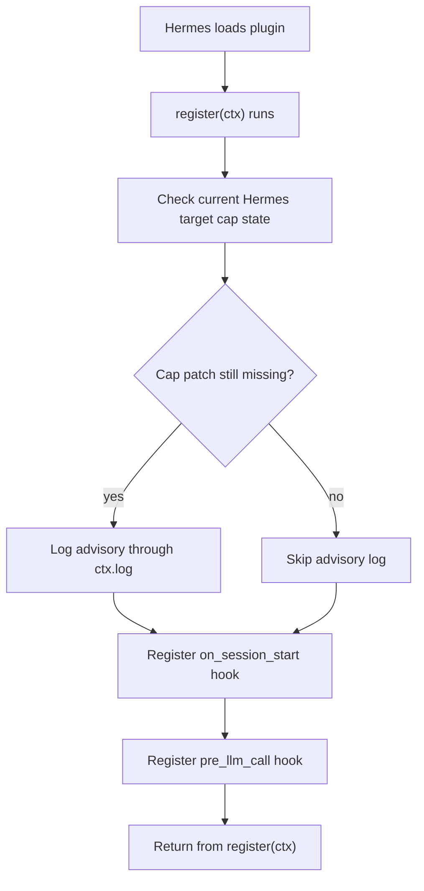
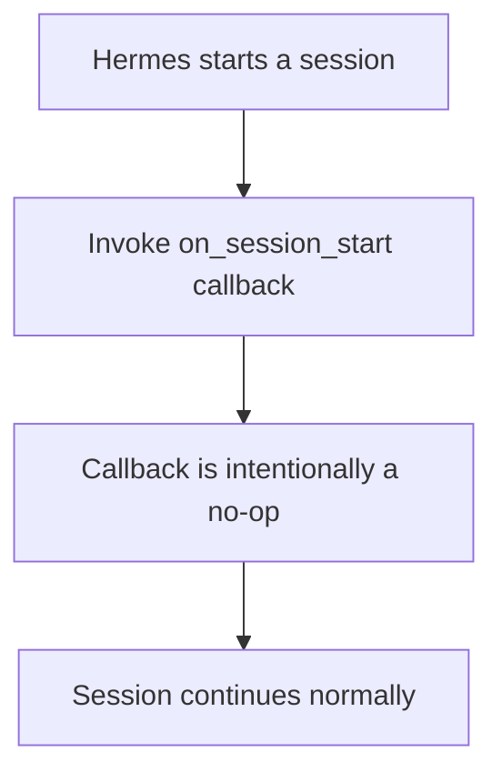
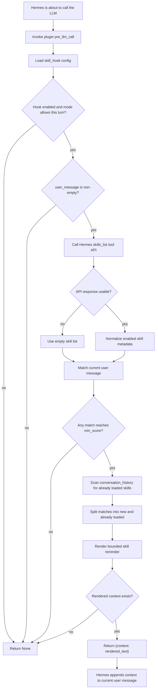
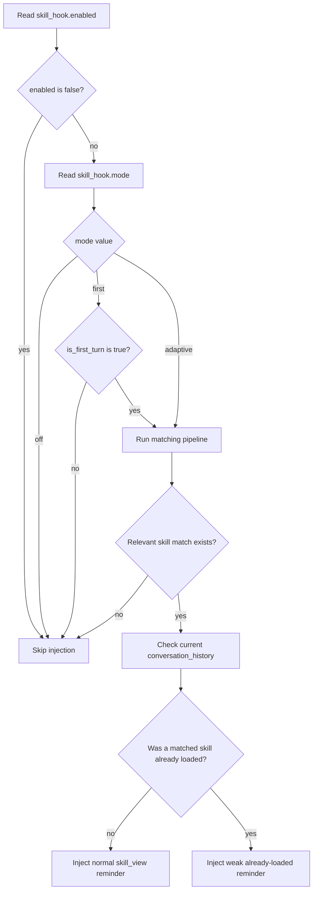
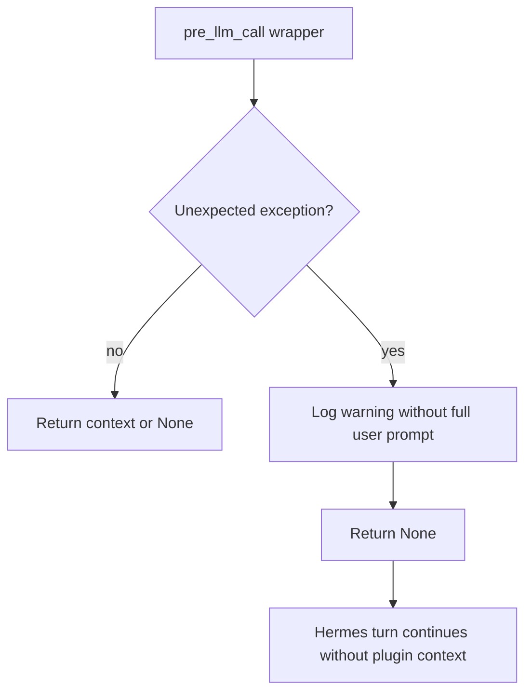

# WOW Skills Plugin Hook Flowcharts

This document describes only the plugin hook behavior added by the adaptive
WOW skills feature. It does not cover release, CI, packaging, or the Hermes
core patcher.

The plugin registers two Hermes hooks:

- `on_session_start` keeps the existing advisory hook registered.
- `pre_llm_call` optionally injects a short, ephemeral skill reminder into the
  current user-message context.

## Hook Registration



The plugin does not call `ctx.register_skill`. Skill discovery stays inside
Hermes; this plugin only adds hook callbacks.

## `on_session_start` Hook



The advisory check happens during `register(ctx)`. The session-start callback
exists so Hermes sees the hook declared by the plugin, but it does not mutate
conversation state.

## `pre_llm_call` Hook



The returned context is ephemeral. It is not a system prompt patch and it does
not load full `SKILL.md` bodies. If a matching skill was already loaded through
`skill_view` or a Hermes skill slash command, the plugin renders only a weak
"already loaded" reminder instead of recommending another main `skill_view`
call.

## Mode Decision



`first` and `adaptive` both use the same matcher. `first` only permits the
matcher on the first turn.

## Fail-open Path



A broken hook must not break the agent turn.

## Chat Example 1: Adaptive Match Injects Context

Config:

```yaml
plugins:
  enabled:
    - easter-hermes-sorry-skills-plugin
  entries:
    easter-hermes-sorry-skills-plugin:
      skill_hook:
        enabled: true
        mode: adaptive
        output: shortlist
        top_k: 3
        min_score: 2
```

Enabled skill metadata returned by Hermes `skills_list()`:

```json
{
  "success": true,
  "skills": [
    {
      "name": "skill-creator",
      "description": "Use when creating or improving SKILL.md instructions.",
      "category": "skills"
    },
    {
      "name": "code-review",
      "description": "Use when reviewing code changes for bugs and regressions.",
      "category": "coding"
    }
  ]
}
```

Conversation before the LLM call:

```text
User:
Create a new Hermes skill for reviewing Python CLI changes.
```

Plugin decision:

- `mode=adaptive` allows this turn.
- `user_message` is non-empty.
- `skills_list()` succeeds.
- `skill-creator` matches through description tokens: `skill`, `creating`.
- `code-review` matches through description/category tokens:
  `reviewing`, `code`, `changes`.
- At least one match reaches `min_score`.

Context returned by the plugin:

```text
Relevant Hermes skills to consider:
- code-review: Use when reviewing code changes for bugs and regressions.
- skill-creator: Use when creating or improving SKILL.md instructions.

Use skill_view(name) only if the current task actually matches.
```

What Hermes sends into the current LLM call conceptually:

```text
User:
Create a new Hermes skill for reviewing Python CLI changes.

[Plugin context]
Relevant Hermes skills to consider:
- code-review: Use when reviewing code changes for bugs and regressions.
- skill-creator: Use when creating or improving SKILL.md instructions.

Use skill_view(name) only if the current task actually matches.
```

Expected model behavior:

```text
Assistant:
I should inspect the relevant skill before drafting this. Calling
skill_view(name="skill-creator") is appropriate because the user is asking to
create a skill.
```

## Chat Example 2: Already Loaded Skill Gets Weak Reminder

Config is the same as Example 1.

Conversation before the current LLM call:

```text
User:
Review this Python CLI patch.

Assistant tool call:
skill_view(name="code-review")

Tool result:
{
  "success": true,
  "name": "code-review",
  "content": "...full SKILL.md instructions..."
}

Assistant:
I loaded the code-review skill and will use it for the review.

User:
Now review the updated tests too.
```

Plugin decision on the second user turn:

- `mode=adaptive` allows this turn.
- `skills_list()` succeeds.
- `code-review` still matches the current user message.
- `conversation_history` shows a successful main `skill_view(name="code-review")`
  result.
- The match is treated as already loaded.

Context returned by the plugin:

```text
Already loaded relevant Hermes skills:
- code-review

Follow already loaded skill instructions; call skill_view(name) again only for linked files.
```

What Hermes sends into the current LLM call conceptually:

```text
User:
Now review the updated tests too.

[Plugin context]
Already loaded relevant Hermes skills:
- code-review

Follow already loaded skill instructions; call skill_view(name) again only for linked files.
```

Expected model behavior:

```text
Assistant:
Continue using the already loaded code-review instructions. Do not reload the
main skill content unless a linked reference file is needed.
```

## Chat Example 3: No Match Means No Context

Config is the same as Example 1.

Conversation before the LLM call:

```text
User:
What time is it in Budapest?
```

Plugin decision:

- `mode=adaptive` allows evaluation.
- `skills_list()` succeeds.
- No enabled skill metadata overlaps strongly with the user request.
- No match reaches `min_score`.

Plugin return value:

```text
None
```

What Hermes sends into the current LLM call conceptually:

```text
User:
What time is it in Budapest?
```

Expected model behavior:

```text
Assistant:
Answer normally. No skill reminder was injected, so there is no extra recency
pressure to call skill_view.
```

## Chat Example 4: `first` Mode Skips Later Turns

Config:

```yaml
plugins:
  entries:
    easter-hermes-sorry-skills-plugin:
      skill_hook:
        enabled: true
        mode: first
        output: names
```

Turn 1:

```text
User:
We will work on skill authoring today.
```

Plugin decision:

- `is_first_turn=True`.
- `mode=first` allows the matcher.
- Relevant skill metadata matches.

Possible context:

```text
Relevant Hermes skills to consider:
- skill-creator

Use skill_view(name) only if the current task actually matches.
```

Turn 2:

```text
User:
Now update the draft description.
```

Plugin decision:

- `is_first_turn=False`.
- `mode=first` blocks the hook before calling `skills_list()`.

Plugin return value on turn 2:

```text
None
```

## Chat Example 5: Hook Error Fails Open

Conversation before the LLM call:

```text
User:
Review this plugin change.
```

Runtime condition:

```text
tools.skills_tool.skills_list raises OSError
```

Plugin decision:

- The API adapter catches the error and returns an empty skill list.
- No match can be produced.
- The hook returns `None`.

What Hermes sends into the current LLM call conceptually:

```text
User:
Review this plugin change.
```

Expected model behavior:

```text
Assistant:
Continue normally. The plugin does not break the turn when skill metadata is
unavailable.
```
